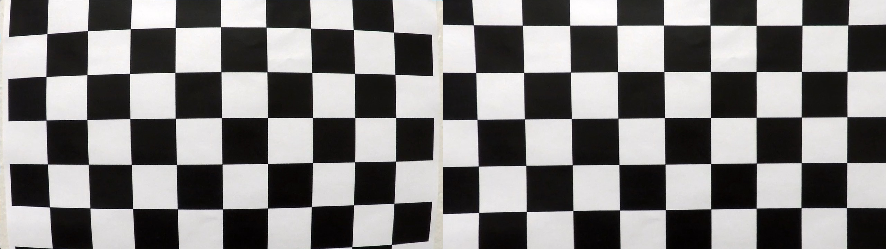

## Advanced Lane Lines

The goals / steps of this project are the following:

* Compute the camera calibration matrix and distortion coefficients given a set of chessboard images.
* Apply a distortion correction to raw images.
* Use color transforms, gradients, etc., to create a thresholded binary image.
* Apply a perspective transform to rectify binary image ("birds-eye view").
* Detect lane pixels and fit to find the lane boundary.
* Determine the curvature of the lane and vehicle position with respect to center.
* Warp the detected lane boundaries back onto the original image.
* Output visual display of the lane boundaries and numerical estimation of lane curvature and vehicle position.

[//]: # (Image References)

[image0]: ./output_images/calibration/calibrated_calibration3.jpg "Single Image Calibration"
[image1]: ./output_images/distortion_correction/distortion_correction_test2.jpg "Undistorted"
[image2]: ./output_images/edge_detection/edge_detection_test2_result.jpg "Edge Detection"
[image3]: ./output_images/perspective_transform/bird_eye_view_test2.jpg "Perspective Transform Transformed"

[image4]: ./examples/binary_combo_example.jpg "Binary Example"
[image5]: ./examples/warped_straight_lines.jpg "Warp Example"
[image6]: ./examples/color_fit_lines.jpg "Fit Visual"
[image7]: ./examples/example_output.jpg "Output"
[video1]: ./project_video.mp4 "Video"

---

### Camera Calibration

The camera calibration function is contained in the `camera_calibration.py` in the method `Camera`.

#### Calibration Process
1. Preparing the "object points", which will be the (x,y,z) coordinates of the chessboard corners.
  I am assuming that the chessboard is fixed to on plane (x, y), therefore z=0. This is done so that the object points are the same for each calibration image.
2. Iterating through the calibration images to look for corners using `cv2.findChessboardCorners()` on gray images.
3. In case corners are detected an objpoint will be appended to a list of matches: `objpoints` for 3D and `imgpoints` for 2D points.
  The `objpoint` is a replicated aarray of coordinates.
4. In order to keep all the 2D and 3D points found, a pickel file is created.
5. At the end those output `objpoints` and `imgpoints` are used to computer the camera calibration and distortion coefficients using `Camera.getCalibration()`
  method with the usage of `cv2.   calibrateCamera` function. This computation depends only on the image size, which is cached from the last image (width, height).

The distortion correction is applied to the test images using the `Camera.undistrot` method running `cv2.undistort()` function to obtain the results:
  <p align="center">
  
</p>

Here an example of a single image calibration
![single image camera calibration][image0]


An example of the distortion correction can be found on the next section.
### Pipeline (single images)
The pipeline steps are depicted in `pipeline.py`.

#### 1. Create a distortion-corrected image
The `cv2.undistort()` function is used in order to create the distortion correction. Prior to perform unidstortion I perfomr a camera calibration which can also be seen in `undistorted.py`
I chose this road image example, because the distortion correction is more visible due to the traffic sign on the left side. Notice the left image, it seems that the camera is leaning to the left side, and on the right image, it is centered.
![single image camera calibration][image1]
The distortion correction is more obvious in the chessboard images, for instance:
  <p align="center">
  
</p>

#### 2. Create a filtered-thresholded image
To create a binary image, a combination of color and gradient thresholds have been used. Both filtering and thresholdinng functions can be found in `perception/filtering.py` and `perception/threshold.py` respectively. The full edge detection is performed by the `DetectEdges()` class.

The implementation of the HLS filter(S channel) is taken from course material Lesson 15, Chapter "HLS Quiz" a function that thresholds the S-channel of HLS and can be found in `filtering.py`. After that, as shown in Chapters "Applying Sobel" and "Direction of the Gradient", the `SobelFilter` class applied a group of Sobel filters(x, y, magnitude, and direction) to the image to produce a binary image to indicate the lines detected

The S channel detects the lane lines on bright images, however, strong shadows are also added to the binary. This channel is usually not able to detect small lane lines on the back of the image or dashed lane lines with long distance between the dashes. The threshold was tuned to remove the car and to be effective different brightness images, following the steps:
1. Apply x or y gradient to a gray image with OpenCV Sobel() function and then take the absolute value.
2. Rescale the image (after sobel filtering) back to 8 bit integer
3. Create a copy and apply the threshold
   Inclusive(>=, <=) thresholds have shown the best results
4. Take the absolute value of the gradient direction, apply a threshold, and create a binary image result

The next figure shows an example where the edge detection performs well enough.
![edges detection][image2]
In this image, one can already see that in the right side of the ego lane, the line detection will require some sort of lane fitting as the line is not whole (solid) but dashed.

#### 3. Create a perspective transform image
For the perspective transform, refer to `warper.py`, the `Warper` class takes as inputs an image (`img`), as well as source (`src`) and destination (`dst`) points. The source and destination points are hardcoded as a dependency to the image size which is: `width = 1280` `length = 720`

```python
src = np.float32(
    [[(img_size[0] / 2) - 55, img_size[1] / 2 + 100],
    [((img_size[0] / 6) - 10), img_size[1]],
    [(img_size[0] * 5 / 6) + 60, img_size[1]],
    [(img_size[0] / 2 + 55), img_size[1] / 2 + 100]])
dst = np.float32(
    [[(img_size[0] / 4), 0],
    [(img_size[0] / 4), img_size[1]],
    [(img_size[0] * 3 / 4), img_size[1]],
    [(img_size[0] * 3 / 4), 0]])
```

| Source        | Destination   |
|:-------------:|:-------------:|
| 578, 460      | 320, 0        |
| 203, 720      | 320, 720      |
| 1127, 720     | 960, 720      |
| 702, 460      | 960, 0        |

To verifiy the perspective transform, find a drawing of the `src` and `dst` points onto a test image and its warped counterpart. The lines appear parallel in the warped image.

![src vs dst points][image3]

#### 4. Describe how (and identify where in your code) you identified lane-line pixels and fit their positions with a polynomial?

Then I did some other stuff and fit my lane lines with a 2nd order polynomial kinda like this:

![alt text][image5]

#### 5. Describe how (and identify where in your code) you calculated the radius of curvature of the lane and the position of the vehicle with respect to center.

I did this in lines # through # in my code in `my_other_file.py`

#### 6. Provide an example image of your result plotted back down onto the road such that the lane area is identified clearly.

I implemented this step in lines # through # in my code in `yet_another_file.py` in the function `map_lane()`.  Here is an example of my result on a test image:

![alt text][image6]

---

### Pipeline (video)

#### 1. Provide a link to your final video output.  Your pipeline should perform reasonably well on the entire project video (wobbly lines are ok but no catastrophic failures that would cause the car to drive off the road!).

Here's a [link to my video result](./project_video.mp4)

---

### Discussion

#### 1. Briefly discuss any problems / issues you faced in your implementation of this project.  Where will your pipeline likely fail?  What could you do to make it more robust?

Here I'll talk about the approach I took, what techniques I used, what worked and why, where the pipeline might fail and how I might improve it if I were going to pursue this project further.
