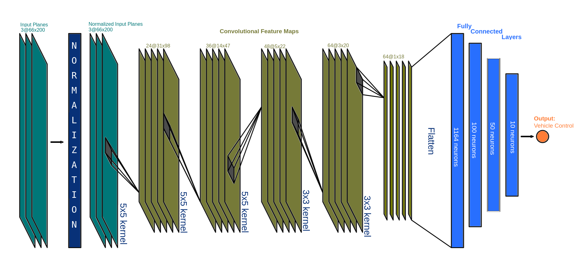
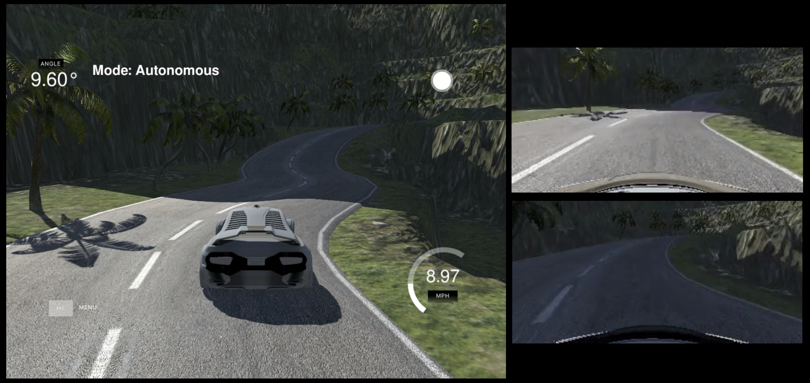

# Behavioral Cloning Project

[](http://www.udacity.com/drive)

Overview
---
This project intends to demonstrate the acquired knowledge in the __Behavioral Clonning__ topic by driving a car autonomously after training a model with recorded data from a simulator.

The granular steps are:

>__1.__ __Collect data__ of expected driving behavior using the [udacity self-driving car simulator](https://github.com/udacity/self-driving-car-sim). In this case I have collected data for both [track_1](record_simulator/track1) and [track_2](record_simulator/track2)

> __2.__ __Get the model__
 In [model.py](model.py), all the necessary steps are described:
>> __2.1.__ [Getting the data set used to train the network](https://github.com/AchachayJurado/NanoDegree/blob/master/CarND-Behavioral-Cloning-P3/model.py#L34)
>> __2.2.__ [Generating training and validation samples](https://github.com/AchachayJurado/NanoDegree/blob/master/CarND-Behavioral-Cloning-P3/model.py#L61) using the [data_generator function](https://github.com/AchachayJurado/NanoDegree/blob/master/CarND-Behavioral-Cloning-P3/utils.py#L16)
>> __2.3.__ Create the NvidiaNet as implemented in [natwork.py](https://github.com/AchachayJurado/NanoDegree/blob/master/CarND-Behavioral-Cloning-P3/natwork.py#L26) at its final implementation of the Neural Network.
>> __2.4.__ Train the keras model
>> __2.5.__ Save the model into a [model.h5](model.h5) file

>__3.__ __Run the model__ with [drive.py](drive.py) while the simulator is in Autonomous mode and validate the quality of the driving.
>> __3.1.__ __Iterate__ back to [2.3.]() and change the hyperparameters, reprocess the image, improve the sample data set when needed.

>__4.__ Using [video.py](video.py), __record the autonomously driven track__ (driver view)

### Dependencies
This lab requires a conda environment with the dependencies specified in file [conda_list.csv](conda_list.csv)


### Model Architecture and Training Strategy

As a general strategy, the model architecture started with a very simple architecture, once the e2e functionality was setup (Steps 1 to 4 were achieved), the iteration and tunning process started.

The base for the CNN architecture was taken from the [Nvidia Convolutional Model](https://developer.nvidia.com/blog/deep-learning-self-driving-cars/) with very few additions such as dropping to reduces overfitting.

<p align="center">
  
</p>

The model consists of:
1. __Image Cropping__ to focus on the important part of the road
   ```input shape (160,320,3) --> output shape = (75, 320, 3)```
2. __Image Normalization__ adding a Keras Lambda
3. __Strided convolution neural networks__ 3 layers with 5x5 filter sizes and depths between 24 and 48 (model.py lines 18-24). Each of them uses RELU activation to introduce nonlinearity.
4. __Non strided convolution neural networks__ 2 layers with 3x3 filter sizes and depth of 64. Each of them uses RELU activation to introduce nonlinearity.
5. __Flatten__
6. __Four fully connected__ layers with dropout to reduce overfitting.

| Layer                  |     Description                                |
|------------------------|------------------------------------------------|
| Input                  | 168x320x3 image                                |
| Cropping               | 75x320x3 image                                 |
| Normalization          | Lambda                                         |
| Convolution 5x5        | 2x2 stride, outputs 31x98x24                   |
| RELU                   |                                                |
| Convolution 5x5        | 2x2 stride, outputs 14x47x36                   |
| RELU                   |                                                |
| Convolution 5x5        | 2x2 stride, outputs 5x22x48                    |
| RELU                   |                                                |
| Convolution 3x3        | outputs 3x20x64                                |
| RELU                   |                                                |
| Convolution 3x3        | outputs 1x18x64                                |
| RELU                   |                                                |
| Flatten                |                                                |
| **Dropout**            |                                                |
| Fully connected        | outputs 1164                                   |
| **Dropout**            |                                                |
| Fully connected        | outputs 100                                    |
| **Dropout**            |                                                |
| Fully connected        | outputs 50                                     |
| **Dropout**            |                                                |
| Fully connected        | outputs 10                                     |

Besides the image and table above, there are explanatory comments in the [natwork.py](natwork.py) implementation of the NvidiaNet.

Several iterations were done based on following observations:
* high mean squared error on the validation set __vs.__ low mean square error in the training set. _Solution_: __Combat Overfitting__ by adding dropout layers and merging training data from track 1 and track 2.
* To improve the sample set, the images are duplicated when flipping option is activated and that prove to be of a great help for unbiasing training data.

## Hands On Demonstration

I am recalling all the steps mentioned in the Overview, but now showing the hands on demonstration of what was done.

##### 1. Creation of the Training Set

I collected the data driving with the [udacity self-driving car simulator](https://github.com/udacity/self-driving-car-sim) for both [track_1](record_simulator/track1) and [track_2](record_simulator/track2). Initial iterations of the network training contained one or the other data set, however later I merged both data sets into one to obtain the final model.

##### 2. Training Process
Run: ```$ python model.py ```
After setting the hyperparameters: ``` EPOCHS, BATCH SIZE``` Choose if you want to augment the size of the data set samples by flipping and adding the side cameras: ``` AUGMENT_BY_FLIPPING, SIDE_CAMERAS_ON ```
The __Training Data Stadistics__ will be printed in the command line:
```
Using Theano backend.
keras: 2.0.9
----------------------------------------------------------------------------------------------
Sample size             2330
Training sample size    1864
Validation sample size  466
Augment by Flipping:    True
Side Cameras On:        True
Sample Factor:          6
Number of augmented training images 11184
----------------------------------------------------------------------------------------------

Number of augmented validation images 2796
Epoch 1/3
11184/11184 [==============================] - 22686s 2s/step - loss: 0.0075 - val_loss: 0.0239
Epoch 2/3
11184/11184 [============================>.] - 22686s 2s/step - loss: 0.0057 - val_loss: 0.0193
Epoch 3/3
11183/11184 [============================>.] - ETA: 1s - loss: 0.0057 - val_loss: 0.0205
```

##### 3. Run the model and see how the car drives autonomously
Once the [model.h5](model.h5) has been created. Launch the simulator in autonomous driving mode.
You can save all the __driver_view__ images by specifying a pth.

```$ python drive.py model.h5 output_images/```

I also opted for saving the video of the simulator using a Kazam application in my Ubuntu 18.04 system.

__Track 1__
<p align="center">
  
</p>

__Track 2__
<p align="center">
  
</p>

#### 4. Create a video of the autonomous agent

Run the [video.py](video.py) script and specify the directory where all the images from the autonomous agent __driver_view__ were saved.
``` $ python video.py output_images/```

Obtain the result videos for each track:
>[Track1_Video (driver_view)](./video_output/track1_driverview.mp4)
<video width="320" height="240" controls>
  <source src="./video_output/track2_driverview.mp4" type="video/mp4">
</video>

>[Track2_Video (driver_view)](./video_output/track2_driverview.mp4)
<video width="320" height="240" controls>
  <source src="./video_output/track2_driverview.mp4" type="video/mp4">
</video>


---
### Shortcomings
* The complexity between the tracks was not comparable and I saw a significant improvement when training the model with a merged version of the training data set samples.

* The GPU processing power required for training the model is huge and therefore it delayed the iteration process. I have requested for AWS access to launch an instance but as I did not received the approval yet, I trained it on a 2 week time frame in my available hardware.

### Improvements
##### To train the model in the AMI created by Udacity
I am looking forward to get the EC2 limit increase request approved to be able to play more with the hyper parameters and tunning possibilities without feeling like I am killing my hardware.

### Future work
##### Use the same training data set in a new track
As both tracks differ a lot, one being quite simple represents no challenge to the autonomous agent, but the other one is too complex full of shadows and two lanes in which one must drive in the center. I would like to realize a future work on testing my model in an intermediate level track to see how it can improvise with the CNN that I proposed.
