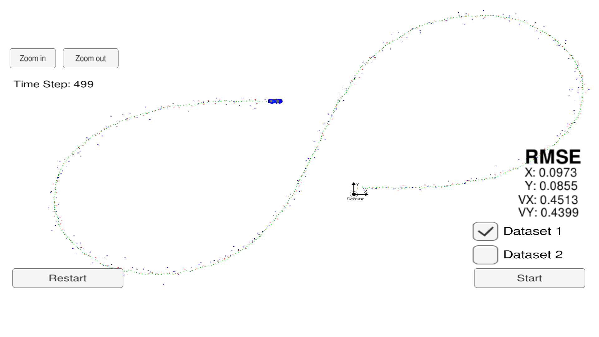
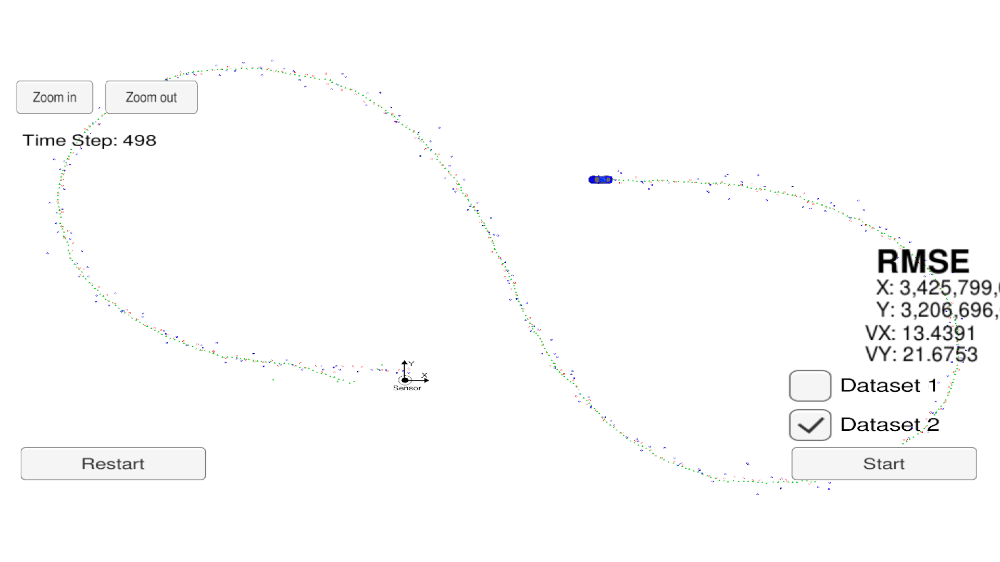

# Extended Kalman Filter Project Starter Code


In this project a kalman filter has been developed to estimate the state of a moving object of interest with noisy lidar and radar measurements.

One of the requirements is that the obtained RMSE values are lower than the tolerance [.11, .11, 0.52, 0.52].

After the //TODO: has been removed and all the missing implementation in the EKF is finished, it must be tested using the [Term 2 Simulator](https://github.com/udacity/self-driving-car-sim/releases).

In order to create the communication between the simulator and the EKF output, a binary is to be created and run, following the steps:
1. mkdir build
2. cd build
3. cmake ..
4. make
5. ./ExtendedKF

The communication protocol that main.cpp uses for uWebSocketIO in communicating with the simulator is as follows:


**INPUT**: values provided by the simulator to the c++ program

["sensor_measurement"] => the measurement that the simulator observed (either lidar or radar)


**OUTPUT**: values provided by the c++ program to the simulator

["estimate_x"] <= kalman filter estimated position x

["estimate_y"] <= kalman filter estimated position y

["rmse_x"]

["rmse_y"]

["rmse_vx"]

["rmse_vy"]

__COMMAND LINE OUTPUT:__
I have added some couts in order to see the estimated x and the RMSE corresponding to it, also ti visualy obbserve the update after a new measurement from Lidar or Radar has come in.
```
x_ =  -8.16108
      10.8292
      4.76408
      -0.189205
RMSE = 0.097631
       0.088092
       0.538735
       0.467586
Update (Laser) -7.51971
               11.0005
x_ =  -7.77955
      10.9042
      5.15254
      0.0386998
RMSE =  0.097537
        0.0880036
        0.538198
        0.467118
UpdateEKF (Radar)  12.8856
                   2.1693
                   -2.77937
x_ =  -7.51129
      10.9031
      5.14932
      0.0779047
RMSE = 0.0974405
       0.0879155
       0.537663
       0.466661
Update (Laser) -7.15631
               10.815
x_ =  -7.23246
```

### Results
_Data Set 1_


_Data Set 2_


For both cases the values of RMSE are lower than the specified tolerance.
See [project rubrics](https://review.udacity.com/#!/rubrics/1962/view)


### References
The material from the Self Driving Car Nanodegree (Sensor Fusion and Extended Kalman Filter) have been used for development of this code.
Find the relevant fomulas [here](https://video.udacity-data.com/topher/2018/June/5b327c11_sensor-fusion-ekf-reference/sensor-fusion-ekf-reference.pdf).

---

## Other Important Dependencies

* cmake >= 3.5
  * All OSes: [click here for installation instructions](https://cmake.org/install/)
* make >= 4.1 (Linux, Mac), 3.81 (Windows)
  * Linux: make is installed by default on most Linux distros
  * Mac: [install Xcode command line tools to get make](https://developer.apple.com/xcode/features/)
  * Windows: [Click here for installation instructions](http://gnuwin32.sourceforge.net/packages/make.htm)
* gcc/g++ >= 5.4
  * Linux: gcc / g++ is installed by default on most Linux distros
  * Mac: same deal as make - [install Xcode command line tools](https://developer.apple.com/xcode/features/)
  * Windows: recommend using [MinGW](http://www.mingw.org/)

## Code Style

I have tried to stick to [Google's C++ style guide](https://google.github.io/styleguide/cppguide.html).

### Future work
The EKF has several applications and I would like to improve my code in the shape of a library that can be extended for other use cases or for more sensor inputs.
