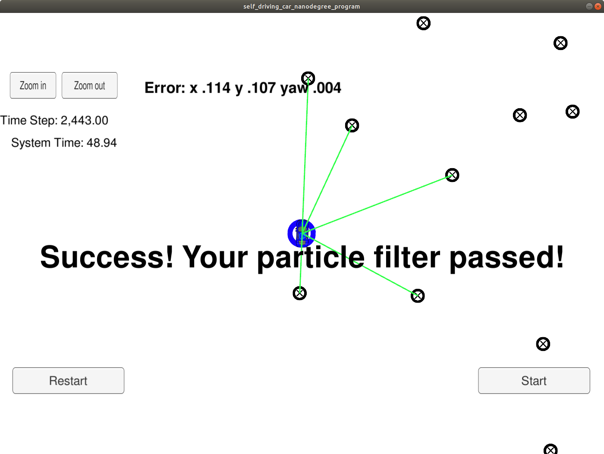

# CarND-Kidnapped-Vehicle-Project
Imagine that your robot has been kidnapped and transported to a new location, fortunately, there3 is a map of this new
location, a noisy GPS estimate of its initial location and a lot of noisy sensor and control data.

### Implementation
2D (2 dimensional) particle filters have been implemented in C++. The particle filter is given a (noisy) map and some
initial localization information (similar to GPS measurements). At every time step, the filter also gets observation
and control data.

### Running the Code
This project involves the [Term 2 Simulator](https://github.com/udacity/self-driving-car-sim/releases).

By running [install-ubuntu.sh](install-ubuntu.sh), the set up and installation of uWebSocketIO is done for Linux systems.
Once the install for uWebSocketIO is complete, the main program can be built and ran by doing the following from the project top directory.

1. mkdir build && cd build
3. cmake .. && make
5. ./particle_filter

### Hints
[Tips for setting up your environment](https://classroom.udacity.com/nanodegrees/nd013/parts/40f38239-66b6-46ec-ae68-03afd8a601c8/modules/0949fca6-b379-42af-a919-ee50aa304e6a/lessons/f758c44c-5e40-4e01-93b5-1a82aa4e044f/concepts/23d376c7-0195-4276-bdf0-e02f1f3c665d)

Here is the main protocol that main.cpp uses for uWebSocketIO in communicating with the simulator.

__INPUT:__ values provided by the simulator to the c++ program
```
// sense noisy position data from the simulator
["sense_x"]
["sense_y"]
["sense_theta"]

// get the previous velocity and yaw rate to predict the particle's transitioned state
["previous_velocity"]
["previous_yawrate"]

// receive noisy observation data from the simulator, in a respective list of x/y values
["sense_observations_x"]
["sense_observations_y"]
```

__OUTPUT:__ values provided by the c++ program to the simulator
```
// best particle values used for calculating the error evaluation
["best_particle_x"]
["best_particle_y"]
["best_particle_theta"]

//Optional message data used for debugging particle's sensing and associations
// for respective (x,y) sensed positions ID label
["best_particle_associations"]

// for respective (x,y) sensed positions
["best_particle_sense_x"] <= list of sensed x positions
["best_particle_sense_y"] <= list of sensed y positions
```

### Inputs to the Particle Filter
The inputs to the particle filter can be found in the `data` directory.

#### The Map*
`map_data.txt` includes the position of landmarks (in meters) on an arbitrary Cartesian coordinate system. Each row has three columns
1. x position
2. y position
3. landmark id

All other data the simulator provides, such as observations and controls.

> * Map data provided by 3D Mapping Solutions GmbH.

### Success Criteria:
Your job is to build out the methods in `particle_filter.cpp` until the simulator output says:

```
average w 1.34465
highest w 0.215273
average w 0.112711
highest w 0.00473234
average w 0.00225707
highest w 0.101017
average w 0.0488582
Success! Your particle filter passed!
```

1. **Accuracy**: your particle filter should localize vehicle position and yaw to within the values specified in the parameters `max_translation_error` and `max_yaw_error` in `src/main.cpp`.

2. **Performance**: your particle filter should complete execution within the time of 100 seconds.
_The simulator visualizes the particle filter and shows success message:_


### References
The following references were used in the implementation of [particle_filter.cpp](particle_filter.cpp):
> [std::normal_distribution](http://en.cppreference.com/w/cpp/numeric/random/normal_distribution)

> [std::default_random_engine](http://www.cplusplus.com/reference/random/default_random_engine/)

>  [transforms](https://www.willamette.edu/~gorr/classes/GeneralGraphics/Transforms/transforms2d.htm)
[transforms_equation_1](http://planning.cs.uiuc.edu/node99.html)
[transforms_equation_2](https://www.miniphysics.com/coordinate-transformation-under-rotation.html)

### Particle filter on action

[Simulator output recorded](./report_images/particle_filter_on_action.mp4)
<video width="320" height="240" controls>
  <source src="./report_images/particle_filter_on_action.mp4" type="video/mp4">
</video>
