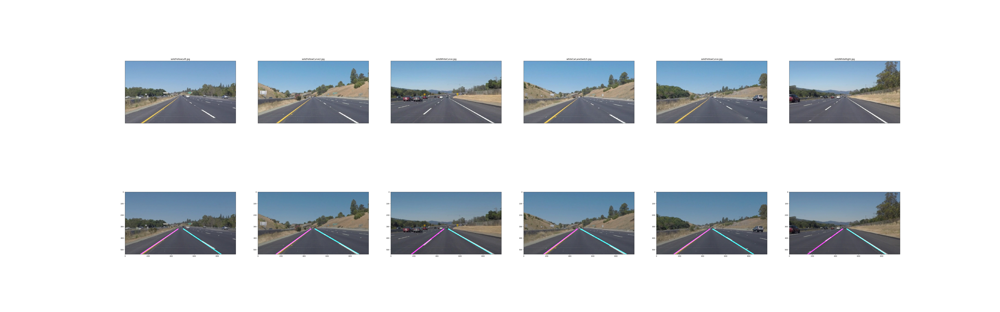
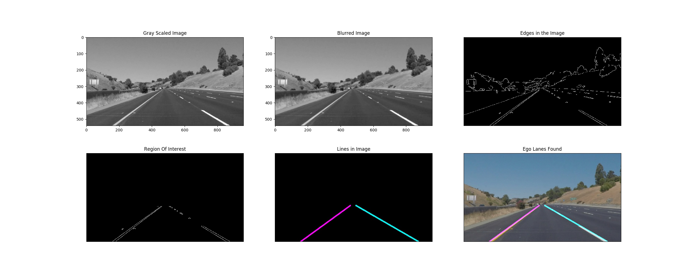
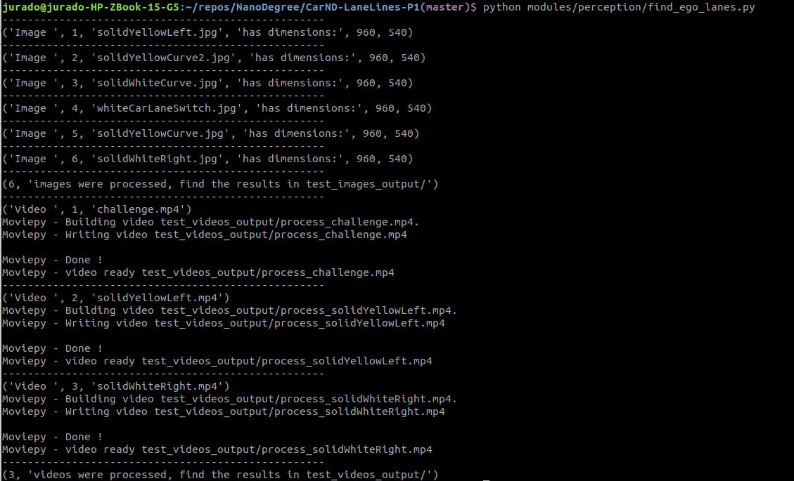

# **Finding Lane Lines on the Road**

Objectives
---
- To create a pipeline to process an image in order to find lane lines.
- To use the pipeline in a set of consecutive images (video).
- To report the steps taken into account in the pipeline.
- To comment on the possible factors that intervene in the solution of this problem.

Overview
---
The problem to be solve within this project is the one of the perception of the possible route to be driven by the car. As we drive, we normally interact with the visual environment (road) containing lane lines and try to steer and control the speed of the car so that we can follow such lane lines.

In a self driving car, the cameras serve as the visual input. However, the images that the camera provides need to be processed in order to isolate the parts of our interest:
1. Get rid of the colors in the image by converting it to a grey scale.
2. Smooth the image, by applying a Gaussian filter
3. Find the edges with the help of Canny Feature Detection
4. Find the region of interest based on the car ego position and the field of view.
5. Find lines within the region of interest, using Hough Line Transform.
6. Draw the found lane lines in the original image.

The stepwise functionality is shown as follows:

To do so, Python and OpenCV has being used.
The file containing the application of the pipeline for the /test_images and /test_videos is find_ego_lanes.py
When executing the script, find the outputs in /test_image_output and /test_video_output directories.
To find more details about the parameters of the filters and transforms used, refer to /modules/perception/utils.py

Shortcomings
---
The parameters in Hough Lines Transform are of a high importance given that the lanes can be solid or dashed, in which case multiple lines can appear and be mistakenly taken as part of the ego lane. An initial version of HoughLineTransform was implemented, to be later replaced by an ImprovedHoughLines() that divides the region of interest in two parts. In this way, the left side of the ego car is merged into a left lane line output and the corresponding is done for the right side.

Improvements and future work
---
When processing the videos, once could see that the influence of a high curvature in the lanes produces a lot of noise in the output. Some efforts were made in order to accomplish a better output by tunning the parameters. However, a better approach may be to not only recognize straight lines using HoughLineTransform but deepen into some regression techniques to enable curved lanes recognition.

Importance of a general architecture
---
In order to have a clear understanding of the problem to be solved, I have taken the initiative of separating the project in modules depending on the answered question. In this case, we wanted to find the ego car lane lines on the road, which is a problem of perception of the environment, therefore this solution is found under that module.
It may not seem of a big importance now, but when the project grows, it is important to have a general overview, which can be achieved by having a good architecture.

# **How to run the project**
Just run the find_ego_lanes.py script and the following output will be gotten:

