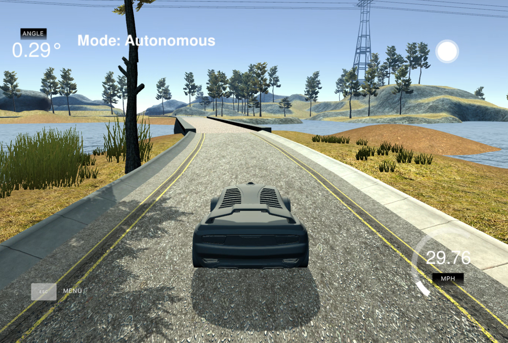

# CarND-Controls-PID
The aim of this project is to tune a ``car_controller.h`` so that the car accelerated (throttles) and steers properly to be kept inside of the lane.

Two independent controllers have been implemented and tunned for those two actuations.
Once the car is properly driving, it can continue endlessly in the track while keeping the lane and decelerating in sharper angles.



When the speed is oscillating between 20 and 30 mph, the car seems to smoothly control itself in the curves. Further tries were done for higher speeds but the curvy road made it very complicated to tune the parameters in such scenario.


## Car Controller

The ``CarController()`` combines 2 PID controllers: one for the steering and one for the accelerating. Both controllers are tunned separately and as a consequence they have different gains.

The output of the controllers is limited to values between [-1,1] to avoid sending dangerous actuations that in real life would even damage the vehicle.

To avoid the integral component of the PID to accumulate large values, an anti-windup technique has been implemented. What it does is that this component won't contribute to the output if the control action exceeds the limits,  but it will keep collecting error. This use case is very useful when the controller set-point is still distant.

The target speed decreases whenever the cross-track-error exceeds a set limit, easing driving on curved parts of the road. The controller will always attempt to go at 30 mph, but the speed can reduce to a minimum of 20 mph.deals with the integral component accumulating too large values

## PID components

**P - Proportional Component**:
This correction is proportional to the error, and is responsible for setting the plant near the setpoint quickly. It is directly related to the control speed. By using a big gain, the plant may oscillate, while too small values may not even have any effect.

**I - Integral Component**:
This correction is proportional to the accumulated error over time. Value increases slowly. It is responsible for setting the steady-state error to zero.

**D - Derivative Component**:
This action is proportional to the rate of change of the error. It is responsible for adjusting the control action when the error changes quickly, allowing a faster response.

### Tuning of PID gains

Both controllers are tuned using the same procedure.  I started by the throttle controller because having a constant speed makes tuning the steering controller easier.

* Tune the controllers one by one
* Deactivate the actuation limits to avoid hiding the effect of the tunned gains.
* Increase the P gain until the system starts oscillating and is still stable.
* Increase the D gain (small values) and verify the oscillations decrease.
* Increase the I gain to compensate for the steady error.
* Test on different setpoints: 20mph-50mph-100mph, straight and curved road.

To debug the values that are output to the actuators, the following is being printed:

``` bash
CTE: 6.305 Speed: 15.7443 Steering Value: -0.559572 Throttle Value: 1
42["steer",{"steering_angle":-0.559572123773561,"throttle":1.0}]
```

### PID Controller in action
[Recording of the simulation](./report/video.mp4)
<video width="320" height="240" controls>
  <source src="./report/video.mp4" type="video/mp4">
</video>


---

## Dependencies

* cmake >= 3.5
 * All OSes: [click here for installation instructions](https://cmake.org/install/)
* make >= 4.1(mac, linux), 3.81(Windows)
  * Linux: make is installed by default on most Linux distros
  * Mac: [install Xcode command line tools to get make](https://developer.apple.com/xcode/features/)
  * Windows: [Click here for installation instructions](http://gnuwin32.sourceforge.net/packages/make.htm)
* gcc/g++ >= 5.4
  * Linux: gcc / g++ is installed by default on most Linux distros
  * Mac: same deal as make - [install Xcode command line tools]((https://developer.apple.com/xcode/features/)
  * Windows: recommend using [MinGW](http://www.mingw.org/)
* [uWebSockets](https://github.com/uWebSockets/uWebSockets)
  * Run either `./install-mac.sh` or `./install-ubuntu.sh`.
  * If you install from source, checkout to commit `e94b6e1`, i.e.
    ```
    git clone https://github.com/uWebSockets/uWebSockets
    cd uWebSockets
    git checkout e94b6e1
    ```
    Some function signatures have changed in v0.14.x. See [this PR](https://github.com/udacity/CarND-MPC-Project/pull/3) for more details.
* Simulator. You can download these from the [project intro page](https://github.com/udacity/self-driving-car-sim/releases) in the classroom.

Fellow students have put together a guide to Windows set-up for the project [here](https://s3-us-west-1.amazonaws.com/udacity-selfdrivingcar/files/Kidnapped_Vehicle_Windows_Setup.pdf) if the environment you have set up for the Sensor Fusion projects does not work for this project. There's also an experimental patch for windows in this [PR](https://github.com/udacity/CarND-PID-Control-Project/pull/3).

## Basic Build Instructions

1. Clone this repo.
2. Make a build directory: `mkdir build && cd build`
3. Compile: `cmake .. && make`
4. Run it: `./pid`.

Tips for setting up your environment can be found [here](https://classroom.udacity.com/nanodegrees/nd013/parts/40f38239-66b6-46ec-ae68-03afd8a601c8/modules/0949fca6-b379-42af-a919-ee50aa304e6a/lessons/f758c44c-5e40-4e01-93b5-1a82aa4e044f/concepts/23d376c7-0195-4276-bdf0-e02f1f3c665d)

## Editor Settings

We've purposefully kept editor configuration files out of this repo in order to
keep it as simple and environment agnostic as possible. However, we recommend
using the following settings:

* indent using spaces
* set tab width to 2 spaces (keeps the matrices in source code aligned)

## Code Style

Please (do your best to) stick to [Google's C++ style guide](https://google.github.io/styleguide/cppguide.html).

## Project Instructions and Rubric

Note: regardless of the changes you make, your project must be buildable using
cmake and make!

More information is only accessible by people who are already enrolled in Term 2
of CarND. If you are enrolled, see [the project page](https://classroom.udacity.com/nanodegrees/nd013/parts/40f38239-66b6-46ec-ae68-03afd8a601c8/modules/f1820894-8322-4bb3-81aa-b26b3c6dcbaf/lessons/e8235395-22dd-4b87-88e0-d108c5e5bbf4/concepts/6a4d8d42-6a04-4aa6-b284-1697c0fd6562)
for instructions and the project rubric.

## Future Work
- Integrate PID controllers with inputs from sensor fusion in order to create a full system.

