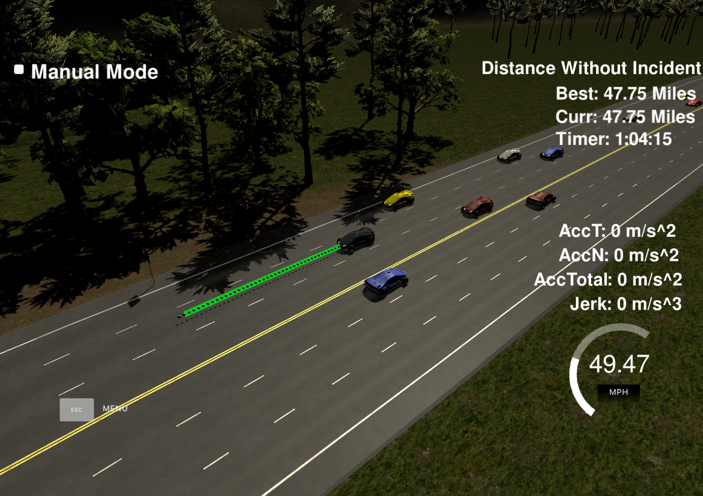
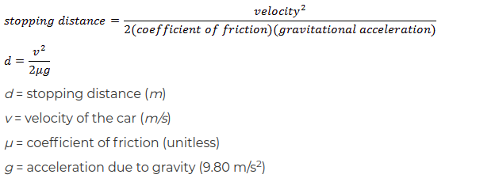

# CarND-Path-Planning-Project
Self-Driving Car Engineer Nanodegree Program

### Simulator.
You can download the Term3 Simulator which contains the Path Planning Project from the [releases tab (https://github.com/udacity/self-driving-car-sim/releases/tag/T3_v1.2).

To run the simulator on Mac/Linux, first make the binary file executable with the following command:
```shell
sudo chmod u+x {simulator_file_name}
```

### Goals
In this project your goal is to safely navigate around a virtual highway with other traffic that is driving +-10 MPH of the 50 MPH speed limit. You will be provided the car's localization and sensor fusion data, there is also a sparse map list of waypoints around the highway. The car should try to go as close as possible to the 50 MPH speed limit, which means passing slower traffic when possible, note that other cars will try to change lanes too. The car should avoid hitting other cars at all cost as well as driving inside of the marked road lanes at all times, unless going from one lane to another. The car should be able to make one complete loop around the 6946m highway. Since the car is trying to go 50 MPH, it should take a little over 5 minutes to complete 1 loop. Also the car should not experience total acceleration over 10 m/s^2 and jerk that is greater than 10 m/s^3.

The car has been able to drive with the specific configuration and parameters for at least ~49 miles with an average speed of 49.5mph (~1 hour) without incidents.




#### The map of the highway is in data/highway_map.txt
Each waypoint in the list contains  [x,y,s,dx,dy] values. x and y are the waypoint's map coordinate position, the s value is the distance along the road to get to that waypoint in meters, the dx and dy values define the unit normal vector pointing outward of the highway loop.

The highway's waypoints loop around so the frenet s value, distance along the road, goes from 0 to 6945.554.

## Basic Build Instructions

1. Clone this repo.
2. Make a build directory: `mkdir build && cd build`
3. Compile: `cmake .. && make`
4. Run it: `./path_planning`.

Here is the data provided from the Simulator to the C++ Program

#### Main car's localization Data (No Noise)

["x"] The car's x position in map coordinates

["y"] The car's y position in map coordinates

["s"] The car's s position in frenet coordinates

["d"] The car's d position in frenet coordinates

["yaw"] The car's yaw angle in the map

["speed"] The car's speed in MPH

#### Previous path data given to the Planner

//Note: Return the previous list but with processed points removed, can be a nice tool to show how far along
the path has processed since last time.

["previous_path_x"] The previous list of x points previously given to the simulator

["previous_path_y"] The previous list of y points previously given to the simulator

#### Previous path's end s and d values

["end_path_s"] The previous list's last point's frenet s value

["end_path_d"] The previous list's last point's frenet d value

#### Sensor Fusion Data, a list of all other car's attributes on the same side of the road. (No Noise)

["sensor_fusion"] A 2d vector of cars and then that car's [car's unique ID, car's x position in map coordinates, car's y position in map coordinates, car's x velocity in m/s, car's y velocity in m/s, car's s position in frenet coordinates, car's d position in frenet coordinates.

## Details

1. The car uses a perfect controller and will visit every (x,y) point it recieves in the list every .02 seconds. The units for the (x,y) points are in meters and the spacing of the points determines the speed of the car. The vector going from a point to the next point in the list dictates the angle of the car. Acceleration both in the tangential and normal directions is measured along with the jerk, the rate of change of total Acceleration. The (x,y) point paths that the planner recieves should not have a total acceleration that goes over 10 m/s^2, also the jerk should not go over 50 m/s^3. (NOTE: As this is BETA, these requirements might change. Also currently jerk is over a .02 second interval, it would probably be better to average total acceleration over 1 second and measure jerk from that.

2. There will be some latency between the simulator running and the path planner returning a path, with optimized code usually its not very long maybe just 1-3 time steps. During this delay the simulator will continue using points that it was last given, because of this its a good idea to store the last points you have used so you can have a smooth transition. previous_path_x, and previous_path_y can be helpful for this transition since they show the last points given to the simulator controller with the processed points already removed. You would either return a path that extends this previous path or make sure to create a new path that has a smooth transition with this last path.

## Description of the Motion Planning

### 1. State Machine
The state machine consist of:
- Keep Lane: The default intended behavior prioritizes the constant speed and the remaining on the ego lane with the maximum speed (49.5 miles per hour).

Once the ego vehicle approaches another vehicle that is driving in front and in the same lane, it has the following options:
* Reduce Speed: For that transition the consideration is based on `GetFastestLane()` function which calculates if the vehicle is already in the fastest lane, if not then:
* Change lane: if a faster lane is detected and it is safe to change the lane (See 2. Safety Distance), then the vehicle changes to it, and following, tries to Keep Lane at a maximum speed of 49.5mph

#### GetFastestLane()
The visible cars in each lane are considered for the calculation of the lane speed. If the vehicles are in the range of the front sensors or maximum 10 meters behind the ego vehicle, one can avoid the collision with vehicles that are directly next to the ego.

In order to select the fastest lane, an iteration over all lanes is performed to finally select the fastest one. If several lanes allow the same fastest speed, the lane that is closest to the ego vehicle is chosen. This helps avoiding unnecessary lane changes.

### 2. Safety distance
To calculate the safe distance to a car that is driving in front of the ego vehicle, the following formula is used:
For more details see implementation in ``MotionPlanning::GetSafeDistance()`` based on the speed of the ego vehicle:



#### SafetyCost
The cost of the lane is calculated to make sure that the ego vehicle stays in its lane if a lane change is not safe. A lane change is considered safe if there is no other vehicle in the target lane within the safety distance of the ego vehicle in front and the safety distance of any vehicle in the target lane.

```cpp
double MotionPlanner::LaneCost(int lane) {
  // find vehicles in the lane that might cause trouble
  // cars in the safety distance before or behind us
  double safety_costs = 0.0;
  for (Vehicle vehicle : vehicles) {
    if (vehicle.lane == lane) {
      if ((wrappedDistance(vehicle.s, ego.s) < safetyDistance(vehicle.speed)) /* ego in front of vehicle */
          || (wrappedDistance(ego.s, vehicle.s) < safetyDistance(ego.speed)) /* ego vehicle in front of ego */) {
        safety_costs += 1.0;
      }
    }
  }
  return safety_costs;
}
```
### 3. Prediction
Based on the end of the previous path, the prediction of the location of the ego vehicle is calculated.

The prediction of the location of other vehicles that are driving in front of the vehicle is computed according to:

```cpp
check_car_s += ((double) prev_size * TICK_S * check_speed);
```

### Trajectory
To create a smooth trajectory, the spline function has been used from http://kluge.in-chemnitz.de/opensource/spline.
The trajectory contains some previous path points of the ego vehicle and some future points from the map.

* In order to avoid jerking, the actual future path points of the ego vehicle are derived from the spline.
* In order to avoid abrupt changes of the velocity, there is incrementally an increase or decrease of the distance between the points of the path.

---

## Dependencies

* cmake >= 3.5
  * All OSes: [click here for installation instructions](https://cmake.org/install/)
* make >= 4.1
  * Linux: make is installed by default on most Linux distros
  * Mac: [install Xcode command line tools to get make](https://developer.apple.com/xcode/features/)
  * Windows: [Click here for installation instructions](http://gnuwin32.sourceforge.net/packages/make.htm)
* gcc/g++ >= 5.4
  * Linux: gcc / g++ is installed by default on most Linux distros
  * Mac: same deal as make - [install Xcode command line tools]((https://developer.apple.com/xcode/features/)
  * Windows: recommend using [MinGW](http://www.mingw.org/)
* [uWebSockets](https://github.com/uWebSockets/uWebSockets)
  * Run either `install-mac.sh` or `install-ubuntu.sh`.
  * If you install from source, checkout to commit `e94b6e1`, i.e.
    ```
    git clone https://github.com/uWebSockets/uWebSockets
    cd uWebSockets
    git checkout e94b6e1
    ```
### Motion Planner on action

[Beginning of the lap recorded](./report/initial_video.mp4)
<video width="320" height="240" controls>
  <source src="./report/initial_video.mp4" type="video/mp4">
</video>

[After 10 minutes drive maneuvers](./report/final_video.mp4)
<video width="320" height="240" controls>
  <source src="./report/final_video.mp4" type="video/mp4">
</video>

## Future Improvements
- Consider miss behavior of surrounding vehicles.
- Behavioral and Trajectory Planner should be stripped off the Motion Planning for architectural purposes.
- KPIs for distance to the center line after maneuvers are to be implemented to improve the safety considerations.
