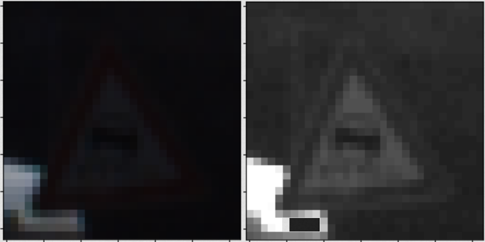
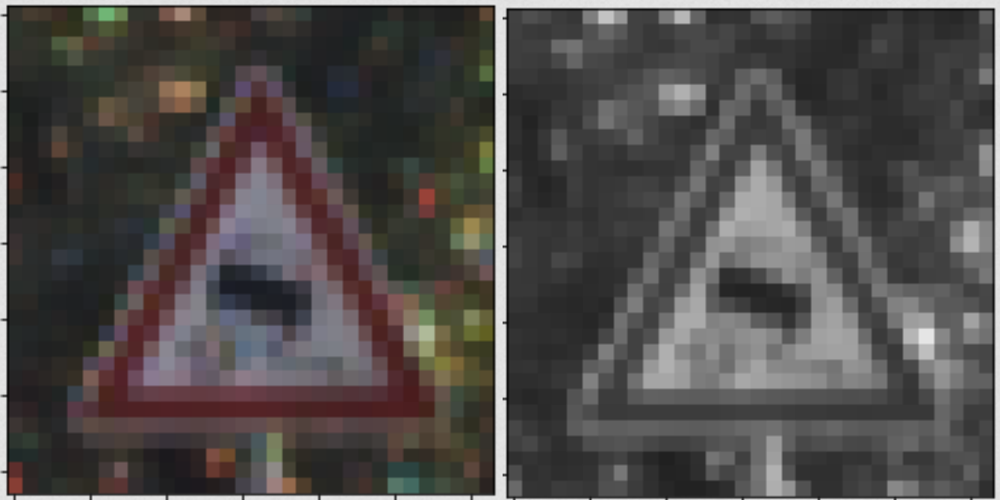

# **Traffic Sign Recognition**

---

[//]: # (Image References)

[image1]: ./images/dataset.png "Visualization"
[image2]: ./images/class.png "Images per Label"
[layers]: ./images/layers.png "Model Architecture"
[model]: ./images/training.png "Model Saved"
[result1]: ./images/result1.png "Traffic Sign Test Images"
[result2]: ./images/result2.png "Test Images + Prob"
[result3]: ./images/result3.png "Top 5 Plot"
[perceptron]: ./images/perceptron.png "Perceptron"

**Build a Traffic Sign Recognition Project**

The goals / steps of this project are the following:
0. **Load the data set**
1. **Dataset Summary & Exploration**
  1.1. Data Summary
  1.2. Exploratory visualization of the dataset
  1.3 Distribution of classes
2. **Design and Test a Model Architecture**
  2.1. Preprocessing
  2.2. Model Architecture
  2.3. Train, Validate and Test the Model
3. **Test the model to make predictions on new images**
  3.1. Load and Output the Images
  3.2. Predict the Sign Type for Each Image
  3.3. Analyze Performance
4. **Analyze the softmax probabilities of the new images**

---
### Data Set Summary & Exploration

#### 1. Provide a basic summary of the data set. In the code, the analysis should be done using python, numpy and/or pandas methods rather than hardcoding results manually.

The pandas library was used to calculate summary statistics of the traffic signs data set:

* The size of training set is 34799
* The size of the validation set is 4410
* The size of test set is 12630
* The shape of a traffic sign image is (32, 32, 3)
* The number of unique classes/labels in the data set is 43

#### 2. Include an exploratory visualization of the dataset.

As a first glance of the data set, below there is an example of each of the images per label and its corresponding 'class'.

![data set visualization][image1]

There are a total of 42 labels. The following image represents a bar chart to visualized the number of sampled per label present in the data set.
![class chart][image2]

### Design and Test a Model Architecture

#### 1. Preprocessing

As a result of the data set exploration, one could observe that many of the images were dark. Therefore, decision was made into converting them to grayscale to achieve reduction of the amount of features and as a result reduction of the execution time.
Find some visual examples of this observation below:
* Before the grayscalation the image is too dark and no features can be identified. This is one of the worst case scenarios but I chose to show the effect of the preprocessing.
  

  

* Also for images that are not so dark, the shape becomes clearer and helps to classify the image. To decide what it is to be done as part of preprocessing, several iterations were done (See 4. Solution Approach - 2nd Iteration)
  

  

Then, a normalization is performed as in (pixel - 128)/ 128 which converts the int values of each pixel [0,255] to float values with range [-1,1]. Find this function in 'preProcess()'.

#### 2. Model Architecture

The model architecture is based on the LeNet model architecture. To prevent over-fitting, dropout layers have been added before each fully connected layer. The final model consisted of the following layers:
![model architecture][layers]

| Layer                  |     Description                                |
|------------------------|------------------------------------------------|
| Input                  | 32x32x1 gray scale image                       |
| Convolution 5x5        | 1x1 stride, valid padding, outputs 28x28x6     |
| RELU                   |                                                |
| Max pooling            | 2x2 stride,  outputs 14x14x6                   |
| Convolution 5x5        | 1x1 stride, valid padding, outputs 10x10x16    |
| RELU                   |                                                |
| Max pooling            | 2x2 stride,  outputs 5x5x16                    |
| Flatten                | outputs 400                                    |
| **Dropout**            |                                                |
| Fully connected        | outputs 120                                    |
| RELU                   |                                                |
| **Dropout**            |                                                |
| Fully connected        | outputs 84                                     |
| RELU                   |                                                |
| **Dropout**            |                                                |
| Fully connected        | outputs 43                                     |
| Softmax                |                                                |

#### 3. Model Training
To train the model, an Adam optimizer and the following hyperparameters were used:
* **batch size**= 50
* **number of epochs**= 150
* **learning rate**= 0.0006
* Variables were initialized using the truncated normal distribution with:
  **mu** = 0.0 and **sigma** = 0.1
* **keep probability of the dropout layer**= 0.5

My final model results were:
* **Training Accuracy** = 94.3%
* **Validation accuracy** = 95.9%
* **Test accuracy** = 95.1%

#### 4. Solution Approach

An iterative approach was used for optimization of validation accuracy, for example using the Learning Rate to move around the missclassified points in order to improve the algorithm:
![alt text][perceptron]

**1st Iteration**.

* As an initial model architecture the original LeNet model from the course was chosen. In order to tailor the architecture for the traffic sign classifier usecase, a 'LeNetKeepProb()' model was adapted  so that the input accepts the color images from the training set with shape (32,32,3).

* Then a modification of the number of outputs was done so that it fits to the 43 unique labels in the training set. The training accuracy was **81.2%** and my test traffic sign "pedestrians" was not correctly classified.
  (used hyper parameters: EPOCHS=10, BATCH_SIZE=128, learning_rate = 0,001, mu = 0, sigma = 0.1)

**2nd Iteration**.
* Grayscaling was added to the preprocessing and the validation accuracy increased to **91%**.
* The hyperparameters were unmodified.

* The additional normalization of the training and validation data resulted in a minor increase of validation accuracy: **91.8%** (hyperparameter unmodified)

**3rd Iteration**.
* Augmented learning rate and increased number of epochs.
* validation accuracy = **87%**
* EPOCHS = 30,
* BATCH_SIZE = 128,
* rate = 0,0007,
* mu = 0,
* sigma = 0.1

**4th Iteration**.
* Added dropout before
* validation accuracy = **95,9%**
* EPOCHS = 50,
* BATCH_SIZE = 128,
* rate = 0,0006,
* mu = 0,
* sigma = 0.1

The final model saved looks as:
![alt text][model]

### Test a Model on New Images
#### 1. Load and Output the Images
The following 10 images were chosen from a German traffic signs data base found on the web:
![alt text][result1]

These images have been selected purposefully as they are similar to others in the data set and they could origin more noise in the classification.
For instance, the "Stop" sign might be confused with the "No entry" sign because both signs have a similar shape and a big red area.

#### 2. Predict the Sign Type for Each Image
Here are the results of the prediction:
**[18 17 13 31 38 12 35 11 34 14]**

These values correspond to the right classes:
* **18** = General Caution
* **17** = No entry
* **13** = Yiel
* **31** = Wild Animals Crossing
* **38** = Keep Right
* **12** = Priority Road
* **35** = Ahead Only
* **11** = Right-of-way at the next intersection
* **34** = Turn Left Ahead
* **14** = Stop

#### 3. Analyze Performance
The labels correspond to the right information, the model was able to correctly guess 10 out of 10 traffic signs, which gives an accuracy of 100%. This compares favorably to the accuracy on the test set of 94.3%

The compiled code divided in the same sections as this description is located in the file 'Traffic_Sign_Classifier.html'.

### Model Certainty - Softmax Probabilities
The top **5** softmax probabilities of the predictions were calculated. To have a visual understanding I have plotted in the left most column the test image and next to it the 5 images with its corresponding probabilities. The lowest top **1** probability was for the sign **General Caution** which was confused with **Traffic Signals**, **Pedestrians**, **Road Narrows** and **Road Work** all of them being a triangular shape. All the other top **1** probabilities are above 99%
![alt text][result2]

To visualize this information better, find a logarithmic bar plot of the probabilities. All the **top 2... top5** are lower than 0.01%
![alt text][result3]

---
### Shortcomings
The general library requirements and the compatibilities represented a problem to me. I was trying to create my project using my own computer environment and not the docker but as I have tensor flow v2.0 several tf functions used in the lectures were not available. All was solved by using the Term 1 docker environment, which is a very practical way of getting rid of this.

### Improvements
##### To visualize the whole pipleine working
A possible improvement to the existing work would be to visualize how the input gets transformed in each step. There are some interesting tools to be explored in that matter.

### Future work
##### Incrementing Training Data
To improve the performance of the classifier, the amount of information for training should be increased to become less susceptible to rotation, translation, zoom, flips, inserting jitter, and/or color perturbation.

##### Iterate more
All the hyperparameters are a great opportunity for creating iteration strategies and designing experiments. It could be a more systematic approach in that sense.

